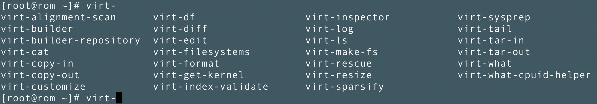
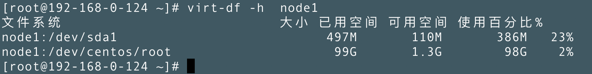
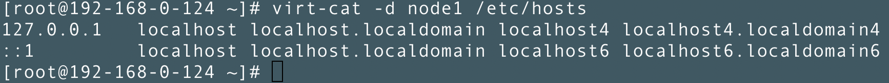
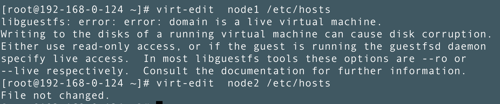
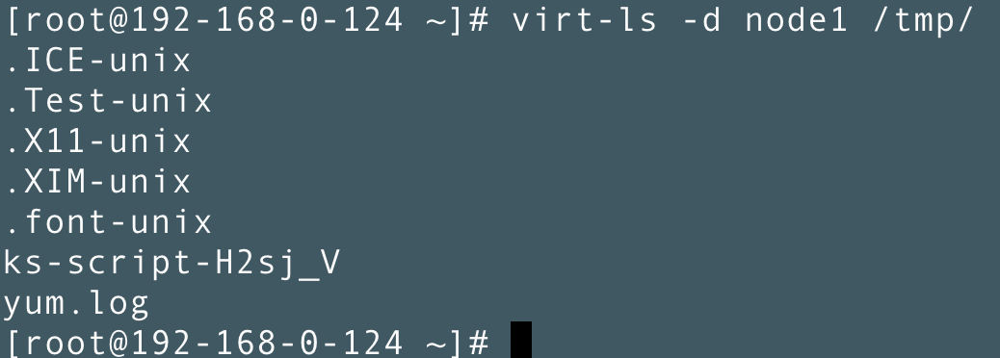
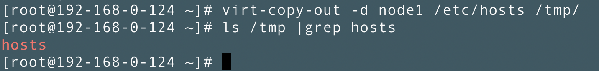
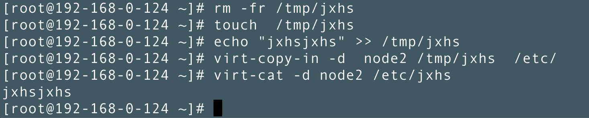
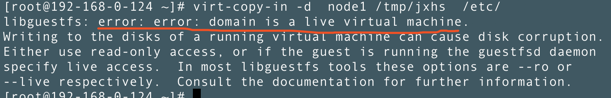

## KVM虚拟化之libguestfs-tools工具常用命令介绍
> 背景:由于kvm虚拟机没有图形化界面，导致模版克隆的虚拟机更改ip很不方便。需要一台台手动登陆去修改，而libguestfs-tools工具能做到给克隆出来的虚拟机更改ip，写成脚本后非常方便使用。
> ### 安装
> ```
> yum -y install libguestfs-tools
> ``` 

## 使用
> libguestfs-tools工具的部分命令使用方便，但是执行速度不是很快，下面只对一些常用命令进行介绍
> 
> 1.virt-df 
> 介绍：类似于虚拟机本地“df”命令
> 
> 2.virt-cat 
> 介绍：类似于虚拟机本地“cat”命令
> 
> 3.virt-edit 
> 介绍：类似于虚拟机本地”vi”命令，使用这个命令需要关闭虚拟机
> 
> 4.virt-ls 
> 介绍：类似于虚拟机本地”ls”命令
> 
> 5.virt-copy-out 
> 介绍：复制虚拟机文件到宿主机本地磁盘，类似于本地”cp”命令
> 
> 6.virt-copy-in 
> 介绍：复制宿主机本地文件到虚拟机磁盘，类似于本地”cp”命令
> 
### 注意 virt-copy-in 以及 virt-edit 命令 需要关闭虚拟机才能执行
> 
